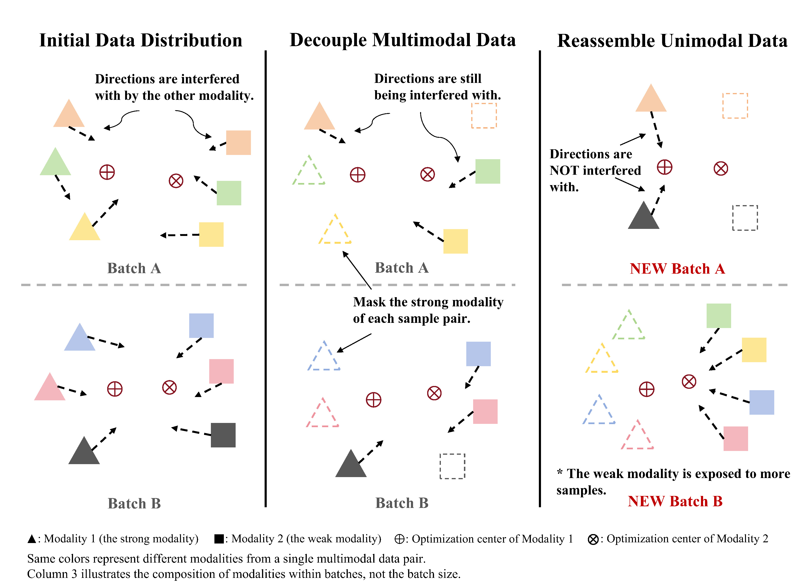
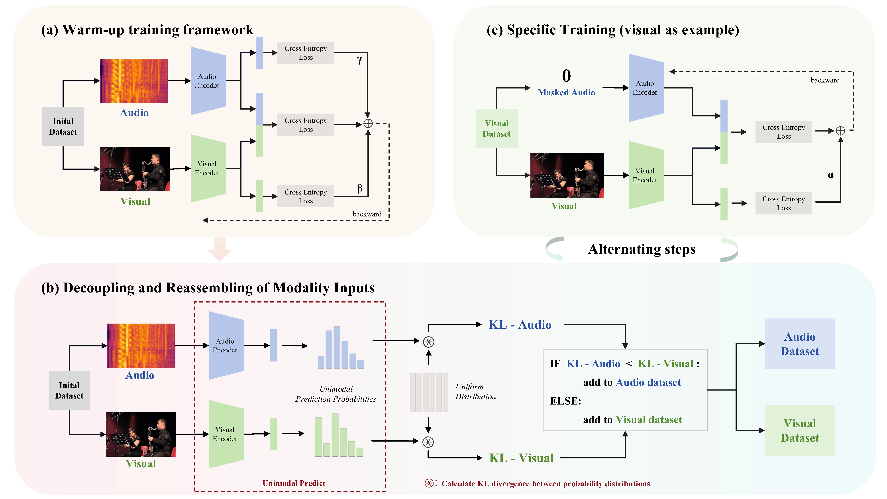

# Codes of Data Remixing

## Introduction

Here is the PyTorch implementation of ''*Improving Multimodal Learning Balance and Sufficiency through Data Remixing*'', which aims to alleviate modality imbalance and modality clash in multimodal learning by decoupling the multimodal input and reassembling by batch. Please refer to our [ICML 2025 paper](https://arxiv.org/abs/2506.11550) for more details.

**Paper Title: "Improving Multimodal Learning Balance and Sufficiency through Data Remixing"**

**Authors: Xiaoyu Ma, Hao Chen, Yongjian Deng**

**Accepted by: 2025 Forty-Second International Conference on Machine Learning(ICML 2025)**

## Motivation

In this work, we address a long-standing but often overlooked problem in the field of balanced multimodal learning, namely **Modality Clash**. This issue arises from differences in the optimization directions of different modalities, which can lead to insufficient learning across all modalities:

+ **Modality Imbalance** is **unidirectional**, which refers to a scenario where a strong modality dictates the learning process, preventing **other modalities** from being sufficiently trained. 

+ **Modality Clash** is **bidirectional**, which describes interference between modalities. *Even if modality balance is achieved*, differences between modalities may still lead to insufficient learning across **all modalities**.



## Method

The pipeline of Data Remixing is as follows:



## Code Instruction

### Environment 

```bash
conda create -n Remix python=3.10 -y
conda activate Remix
pip install -r requirements.txt
```

### Data Preparation 

We adopted the approach described in [OGM-GE_CVPR2022](https://github.com/GeWu-Lab/OGM-GE_CVPR2022) to process all multimodal datasets.

### Train Baseline and Remix Methods

You can refer to the comments in `train.py` to understand the purpose of each hyperparameter and make the corresponding adjustments accordingly.

```Bash
# Baseline
bash scripts/run_baseline.sh
# Remix
bash scripts/run_train.sh
```

## Citation

If you find this work useful, please consider citing it.

```
@article{ma2025improving,
  title={Improving Multimodal Learning Balance and Sufficiency through Data Remixing},
  author={Ma, Xiaoyu and Chen, Hao and Deng, Yongjian},
  journal={arXiv preprint arXiv:2506.11550},
  year={2025}
}
```

## Contact us

If you have any detailed questions or suggestions, you can email us: **[xiaoyuma.kb@gmail.com](mailto:xiaoyuma.kb@gmail.com)** 
